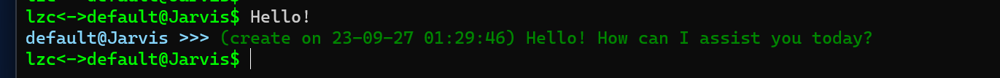
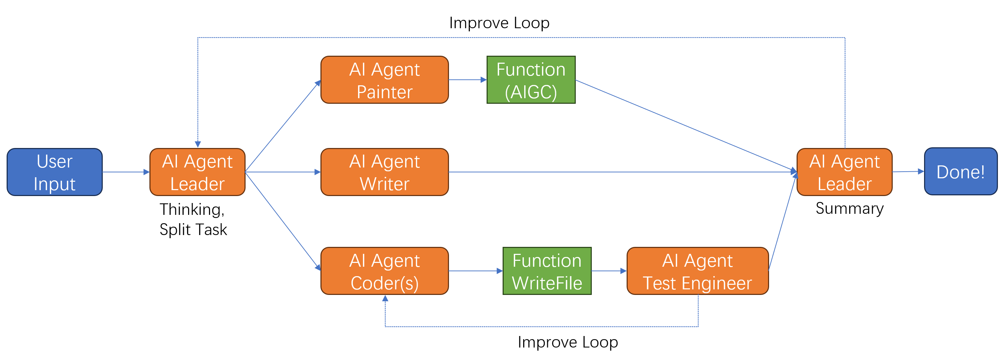
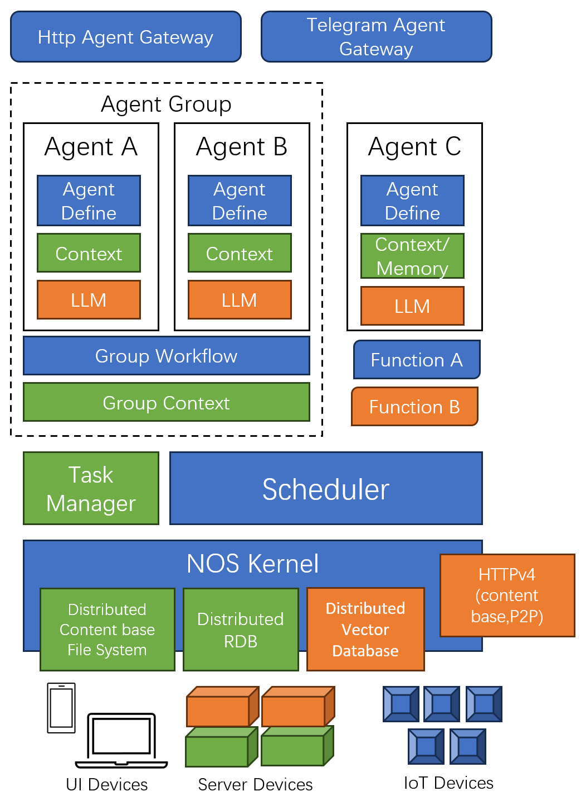

# **OpenDAN : Your Personal AIOS**

[](https://opendan.ai)
[](https://github.com/fiatrete/OpenDAN-Personal-AI-OS/stargazers)
[](https://twitter.com/openDAN_AI)

OpenDAN is an open source Personal AI OS , which consolidates various AI modules in one place for your personal use.

## **Project Introduction**

OpenDAN (Open and Do Anything Now with AI) is revolutionizing the AI landscape with its Personal AI Operating System. Designed for seamless integration of diverse AI modules, it ensures unmatched interoperability. OpenDAN empowers users to craft powerful AI agents—from butlers and assistants to personal tutors and digital companions—all while retaining control. These agents can team up to tackle complex challenges, integrate with existing services, and command smart(IoT) devices.

With OpenDAN, we're putting AI in your hands, making life simpler and smarter.

This project is still in its very early stages, and there may be significant changes in the future.

## **Updates**

After over three months of development, the code for the first version of OpenDAN MVP (0.5.1), driven by the new contributor `waterflier`, has been merged into the Master branch. This version has realized many concepts proposed in the PoC version of OpenDAN and completed the basic framework of the OS, especially defining the application form on AIOS. Currently, the 0.5.1 version operates in an "all-in-one" mode. For 0.5.2, we will advance the formal implementation of the OpenDAN OS kernel based on the partial framework code of the [CYFS Owner Online Device(OOD) OS](https://github.com/buckyos/CYFS) that has already been completed.


**The main new features of OpenDAN 0.5.1 (MVP) :**

- [x] Rapid installation and deployment of OpenDAN based on Docker, making OpenDAN compatible with a wide range of hardware environments (PC/Mac/RaspberryPI/NAS) through Docker.
- [x] AI Agent's large language model can be switched, now supporting locally running the open-source model (LLaMa).
- [x] Introduction of more built-in AI Agents:
    - [x] Personal Assistant Jarvis : Consultant.Assistant who anages your schedule and communication records. ChatGPT alternative.
    - [x] Information Assistant Mia : Manage your personal data and sort it into a knowledge base
    - [x] Private English Teacher Tracy : Your private English teacher
    - [x] ai_bash (for developers) :No longer need to memory complicated command line parameters! Bash is used by "Find FILES in ~/Documents that Contain OpenDAN".
- [x] Connectivity to AI Agent/Workflow via Telegram/Email.
- [x] Building a local private Knowledge Base based on existing file or email spiders, enabling AI Agent access to personal data.
    - [x] Supports text files and common image formats.
    - [ ] Supports other common formats.
- [x] Implemented Workflow: Collaboration of Agents to solve more complex issues.
    - [x] Built-in Workflow story_maker, integrated the AIGC tool to create audio fairy tale books.
- [x] Distributed AI computing core available for complex selections.
- [x] Manual download and installation of new Agent/Workflow.
- [ ] OpenDAN Store : Agent/Workflow/Models One-Stop installation  (Delayed to 0.5.2).

[Try it NOW!](./doc/QuickStart.md)

Developers [click here](https://github.com/fiatrete/OpenDAN-Personal-AI-OS/issues/46) to learn about OpenDan's system development updates.

## **Intro video - What is OpenDAN?**

Click the image below for a demo:

[](https://www.youtube.com/watch?v=l2QmsIOXhdQ "Intro Video")

## **Subscribe to updates here**

<https://twitter.com/openDAN_AI>

## **Installation**

There are two ways to install the Internal Test Version of OpenDAN:

1. Installation through docker, this is also the installation method we recommend now
2. Installing through the source code, this method may encounter some traditional Python dependence problems and requires you to have a certain ability to solve.But if you want to do secondary development of OpenDAN, this method is necessary.

### Preparation before installation

1. Docker environment
This article does not introduce how to install the docker, execute it under your console

```
docker -version
```

If you can see the docker version number (> 20.0), it means that you have installed Docker.
If you don't know how to install docker, you can refer to [here](https://docs.docker.com/engine/install/)

2. OpenAI API Token
If there is no api token, you can apply for [here](https://beta.openai.com/)

Applying for the API Token may have some thresholds for new players. You can find friends around you, and he can give you a temporary, or join our internal test experience group. We will also release some free experience API token from time to time.These token is limited to the maximum consumption and effective time

### Install

After executing the following command, you can install the Docker Image of OpenDAN

```
docker pull paios/aios:latest
```

## **Run OpenDAN**

The first Run of OpenDAN needs to be initialized. You need to enter some information in the process of initialization. Therefore, when starting the docker, remember to bring the -it parameter.

OpenDAN is your Personal AIOS, so it will generate some important personal data (such as chat history with agent, schedule data, etc.) during its operation. These data will be stored on your local disk. ThereforeWe recommend that you mount the local disk into the container of Docker so that the data can be guaranteed.

```
docker run -v /your/local/myai/:/root/myai --name aios -it paios/aios:latest 
```

In the above command, we also set up a Docker instance for Docker Run named AIOS, which is convenient for subsequent operations.You can also use your favorite name instead.

After the first operation of the docker instance is created, it only needs to be executed again:

```
docker start -ai aios
```

If you plan to run in a service mode (NO UI), you don't need to bring the -AI parameter:

```
docker start aios
```

### Hello, Jarvis

After the configuration is completed, you will enter a AIOS Shell, which is similar to Linux Bash and similar. The meaning of this interface is:
The current user "username" is communicating with the name "Agent/Workflow of Jarvis". The current topic is default.

Say Hello to your private AI assistant Jarvis !

**If everything is OK, you will get a reply from Jarvis after a moment .At this time, the OpenDAN system is running .**


## **Core Concepts and Features of OpenDAN**
1. **AI Agent**: Driven by a large language model, having own memory.The AI Agent completes tasks through natural language interaction.
2. **AI Workflow**: Organize different AI Agents into an AI Agent Group to complete complex tasks.

3. **AI Environment**: Supports AI Agents to access file systems, IoT devices, network services, smart contracts, and everything on today's internet once authorized.
4. **AI Marketplace**: Offer a solution for one-click installation and use of various AI applications, helping users easily access and manage AI apps.
5. **AI Model Solution**: Provide a unified entry point for model search, download, and access control, making it convenient for users to find and use models suitable for their needs.
6. **Hardware-specific optimization**: Optimize for specific hardware to enable smooth local running of most open-source AI applications.
7. **Strict Privacy Protection and Management**: Strictly manage personal data, ranging from family albums to chat records and social media records, and provide a unified access control interface for AI applications.
8. **Personal knowledge Base**:
9. **Integrated AIGC Workflow**: Offer AIGC Agent/Workflow for users to train their own voice models, Lora models, knowledge models, etc., using personal data. Based on these private model data, integrate the most advanced AIGC algorithm to help people release creativity easily and build more COOL and more personalized content.
10. **Development Framework**: Provide a development framework for customizing AI assistants for specific purposes, making it easy for developers to create unique AI applications / service for their customers.

## **Deeply Understanding OpenDAN**

### Build OpenDAN from source code
1. Install the latest version of python (>= 3.11) and pip
1. Clone the source code
   ```
   git clone https://github.com/fiatrete/OpenDAN-Personal-AI-OS.git
   cd OpenDAN-Personal-AI-OS
   ```
1. Enable virtual env
   ```
   virtualenv venv
   source ./venv/bin/activate
   ```
1. Install the dependent python library
   ```
   pip install -r ./src/requirements.txt
   ```
   Waiting for installation.
1. Start OpenDAN through aios_shell
   ```
   python ./src/srvice/aios_shell/aios_shell.py
   ```
   1. If seeing error saying `No ffmpeg exe could be found`, you need to install it manually from https://www.ffmpeg.org/
      
Now OpenDAN runs in the development mode, and the directory is:
- AIOS_ROOT: ./rootfs (/opt/aios in docker)
- AIOS_MYAI: ~/myai (/root/myai in docer)

### OpenDAN Cookbook

#### Chapter 1: Hello, Jarvis! 
- 1.1 Installation of OpenDAN
- 1.2 Initial Configuration of OpenDAN
- 1.3 Introduction to Agent and Using Jarvis
- 1.4 Communicating with Jarvis Anytime and Anywhere via Telegram and Email
- 1.5 Using Jarvis in Daily Life
- 1.6 Mia and the Knowledge Base
- 1.7 Introduction to Other Built-in Agents

[Click to Read](./doc/QuickStart.md)

#### Chapter 2: AIGC Workflow （Coming Soon）
Using Workflow to activate the AIGC feature and let the Agent team (director, artist, and narrator) collaborate to create a unique bedtime story for your child based on your instructions!

- 2.1 Using Workflow `story_maker`
- 2.2 Enabling Your Own AIGC Computation Node
- 2.3 Training and Using Your Own AIGC LoRA Model.

#### Chapter 3: Develop Agent/Workflow on OpenDAN (Writing)

What's the most crucial design aspect of an operating system? Defining new forms of applications!

This article will systematically introduce what future Intelligence Applications look like, how to develop and release Intelligence Applications, and how to connect new-age Intelligence Applications with traditional computing.

- 3.1 Developing Agents that Run on OpenDAN
- 3.2 Developing Workflows that Run on OpenDAN
- 3.3 Extending the Environments Accessible by Agents
- 3.4 Releasing Various Models Trained by Yourself
- 3.5 Expanding More Tunnels to Enhance the Accessibility of Agents/Workflow
- 3.6 Developing Traditional dApps on the Personal Server.

#### Chapter 4: OpenDAN Kernel Development (Writing)
This article will introduce the design and implementation of OpenDAN's architecture




- 4.1 Integrate your own LLM core into OpenDAN.
- 4.2 Knowledge Base: Expand more file types, allowing Agents to better understand your knowledge graph.
- 4.3 AI computation engine, integrating more AIGC capabilities, and accessing more computational power.
- 4.4 OpenDAN's state management: File system and vector database.
- 4.5 Kernel services and permission isolation.
- 4.6 Smart gateway.


## **Upcoming Roadmap**

- [x] Release PoC of OpenDAN
- [x] **0.5.1** Implement personal data embeding to Knownlege-Base(KB) via Spider, followed by access by AI Agent
- [ ] 0.5.2 Separate user mode and kernel mode, Knowledge Base supports scene format and more Spiders, supports personal AIGC model training
- [ ] 0.5.3 Release Home Environment, allowing Agents to access and control your home's IoT devices
- [ ] 0.5.x Official version of OpenDAN Alpha. Release OpenDAN SDK 1.0.

## **Contributing**

We welcome community members to contribute to the project, including but not limited to submitting issues, improving documentation, fixing bugs, or providing new features. You can participate in the contribution through the following ways:

- Submit an Issue in the GitHub repository
- Submit a Pull Request to the repository
- Participate in discussions and development

OpenDAN utilizes the SourceDAO smart contract to incentivize the community. Developers who contribute can receive rewards in the form of OpenDAN DAO Tokens. DAO Token holders can collaboratively determine the development direction of OpenDAN. You can learn more about the rules of SourceDAO by reading this article（ https://github.com/fiatrete/OpenDAN-Personal-AI-OS/issues/25 ）

The DAO governance page for OpenDAN is under development. Once officially launched, all contributors will receive DAO Tokens according to the rules.

## **⭐Star History**

[](https://star-history.com/#fiatrete/OpenDAN-Personal-AI-Server-OS&Date)

## **License**

The current license is MIT, but it will transition to SourceDAO in the future.
