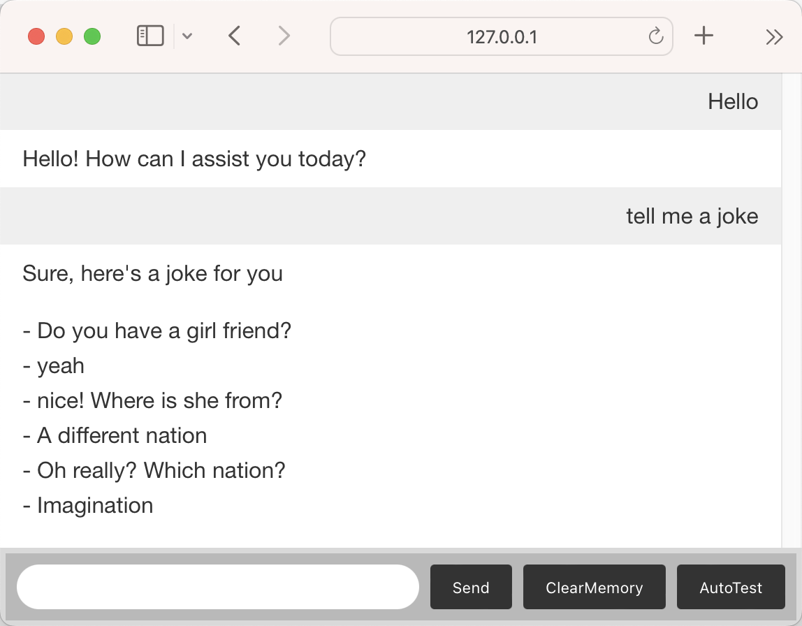

# Jarvis

## 1. What is Jarvis

Jarvis is the built-in AI agent/AI butler residing on OpenDAN AI OS. It's a prototype of an AI assistant that is intelligent and extensible.

On the surface, Jarvis may appear similar to those existing AI assistants like Cortana or Siri, but behind the scenes it is quite different. Jarvis's intelligence is powered by large language models, giving it a degree of thinking and reasoning abilities. The LLM engine of Jarvis can be configured to closed-source products like ChatGPT or Claude, as well as open-source LLMs like Vicuna, Alpaca and so on.

Also, unlike traditional AI assistants, Jarvis is **customizable** and **extensible**. You can freely and easily provide Jarvis with more skills by installing functional modules and services to the OpenDAN AI OS, enabling it to do more for you. While it starts as an AI assistant, helping with basic tasks like scheduling meetings or controlling smart home devices, Jarvis can grow into so much more. We built Jarvis to be an open-ended platform for artificial intelligence at home. With consistent improvements over time, Jarvis may become far more advanced than any existing consumer AI product.

## 2. Run Jarvis

First we need to config LLM engine. At present, we use ChatGPT as the LLM engine and you need to provide an OpenAI API KEY in the `.env` config file.

Follow the code below:

```bash
# Assuming your current workding directory is ${project_root}, i.e., the directory containing this README.md file.

# Pull the docker image
# NOTE: You may need root privilege, if your docker daemon only allows root.
docker pull fiatrete/jarvis

# Create our workspace and enter
mkdir -p docker/jarvis
cd docker

# copy necessary files
cp ../.env_template jarvis/.env

# Edit '.env' and configure JARVIS_OPENAI_API_KEY.
# By default Jarvis uses gpt-3.5. You can use other version by setting JARVIS_LLM_MODEL and JARVIS_SMALL_LLM_MODEL.
vim jarvis/.env

# Assuming jarvis's listening port is 10000 (According to you '.env' configuration).
# WARNING for windows users:
#   I don't know why, but as a fact, executing the command below using git-bash may fail due to docker maps a wrong path.
#   You can try to use powershell/cmd to run the docker container. Don't forget to change '`pwd`' to the absolute path of
#   our current workding directory, i.e., the 'docker' folder.
docker run --name jarvis --rm \
    -p 10000:10000 \
    -v `pwd`/jarvis/.env:/root/.env \
    fiatrete/jarvis:latest

```

Then you can open your browser, and navigate to `http://127.0.0.1:10000`.

You will see a simple chat window, and you can chat with Jarvis with it. This is a showcase of the interaction with Jarvis. It is more practical to use Telegram or discord bot to interact with Jarvis and we will provide the code later. 
 
 

At this moment, Jarvis is most likely a copy of ChatGPT, except that we provide a joke telling ability as an example.

## 3. Enable Jarvis with drawing capabilities

To enable Jarvis with drawing capabilities, you will need to set up an Stable Diffusion webui with `--api` enabled. The OpenDAN AI OS will provide a one-click installation of Stable Diffusion webui in the future, but you will have to install it by yourself for now.

```bash
# Assuming your current workding directory is ${project_root}, i.e., the directory containing this README.md file.
cd docker

# Edit '.env' and configure DEMO_STABLE_DIFFUSION_ADDRESS
# e.g. http://192.168.3.254:1997
# NOTE: Do *** NOT **** use 'localhost' or '127.0.0.1' or other loopback address, 
#   since we don't use host network in docker.
vim jarvis/.env

# Assuming jarvis's listening port is 10000 (According to you '.env' configuration).
docker run --name jarvis --rm \
    -p 10000:10000 \
    -v `pwd`/jarvis/.env:/root/.env \
    jarvis:latest

```

Then you can ask Jarvis to generate images for you in the chat window. You may say "Jarvis, generate a photo of a beautiful girl" for example.

 

## 4. Enable Jarvis with the ability to summarize YouTube videos and send tweets

To enable Jarvis with the ability to summarize YouTube videos and send tweets you need to:

1. provide Twitter API keys and setup them in `.env`. see Appendix A.1

```
# == Twitter
# https://developer.twitter.com/en/portal/dashboard
# The consumer key
DEMO_TWITTER_CONSUMER_KEY=
DEMO_TWITTER_CONSUMER_SECRET=
# The access token (not 'Bearer Token')
DEMO_TWITTER_ACCESS_TOKEN=
DEMO_TWITTER_ACCESS_TOKEN_SECRET=
# Your twitter account, i.e., the last part of your twitter profile page, the part followed by '@'
# e.g. Elon Musk, his account names is 'elonmusk'
DEMO_TWITTER_USERNAME=
```

2. provide YouTube access key and setup `DEMO_YOUTUBE_API_KEY` in `.env`. see Appendix A.2

Then startup Jarvis open the chat window in your browser:

```bash
cd docker

# Assuming jarvis's listening port is 10000 (According to you '.env' configuration).
docker run --name jarvis --rm \
    -p 10000:10000 \
    -v `pwd`/jarvis/.env:/root/.env \
    jarvis:latest

```

Now you can send YouTube urls to Jarvis and ask him to summarize the content of the video. Also, you can ask him to send tweets.

# 5. How to extend its abilities

There are some example external functional modules in `${project_root}/../example_modules` directory.

The main program of Jarvis will scan `JARVIS_EXTERNAL_FUNCTION_MODULE_DIR` recursively, and load all functional modules found.

A functional module is denoted by a `.module.py` file. Once a `.module.py` file found, then this directory is a functional module, then `.module.py` will be loaded as a python module, and the subdirectories of this module will not be further scaned.

To make the life easier, the funcitonal module directories will be added to python's module search pathes. Thus, you can import python modules using a package name relative to the `.module.py` file's containing directory. And also, watch out module name confliction.

Please refer to the example modules, and try to write a module by yourself.

# 6. Trouble shoot

If you cannot run Jarvis successfully, you can set `JARVIS_LOG_LEVEL` to `debug`, and set `JARVIS_DEBUG_MODE` to `true`, in the `.env` file. And run it again.

The log file is located in the docker container at:

1. `/root/jarvis/log.txt`: This is the main log.
2. `/root/jarvis/supervisor_log/{xxx}_std{yyy}.log`: These are `stderr` and `stdout` of our services.

**Q: Docker repeatedly says `exit: {some service} (exit status {y}, not expected)`**

**A:** Check the `.env` file.

1. Ensure that the `.env` file is mapped correctly.
2. Ensure that all mandatory options in the `.env` file are set.

**Q: Jarvis always reply: `Sorry, but I don't know what you want me to do.`**

**A:** Check the `.env` file.

1. Ensure that `JARVIS_OPENAI_API_KEY` is set correctly;
2. Ensure that `JARVIS_OPENAI_API_KEY` is valid;
3. Ensure that you can access OpenAI' API;
4. You may need to set `JARVIS_OPENAI_URL_BASE` if your key is not provied by OpenAI;

**Q: Jarvis always fails to execute `twitter`/`youtube`/`stable-diffusion` related job.**

**A:** Check the `.env` file. Ensure that the corresponding configurations are all set correctly.

If your issue is not listed above or you have any questions. **Feel free to open an issue. We are happy to discuss with you.**

# A. Appendix

## A.1. How to get keys from twitter

1. Register a twitter developer account.
2. Create an application in twitter [portal dashboard](https://developer.twitter.com/en/portal/dashboard).
3. In your app detail page, navigate to `Settings -> User authentication settings -> Edit`.
4. Select `Read and write` in `App permissions` table.
5. Navigate to `Keys and Tokens` tab.
6. Create an `API Key and Secret(Consumer Keys)` and an `Access Token and Secret`.

**NOTE: You must select `Read and write` first, then create keys. If the keys were created first, you will have to recreate the keys again.**

Both these keys and their corresponding secrets are required in the `.env` file.

## A.2. How to get a youtube access key.

This is relatively simple.

1. Register a google developer account. (You might have one already.)
2. Create a project in [google api dashboard](https://console.cloud.google.com/apis/dashboard), and select it. 
3. Enable `YouTube Data API v3`.
4. Create `API Key` at [google credentials page](https://console.cloud.google.com/apis/credentials). If you were asked to configure an OAuth page, do it first.

The created API key string is what we want.

## A.3. How to get google calendar's authorization token

1. Register a google developer account.
2. Create a project in [google api dashboard](https://console.cloud.google.com/apis/dashboard), and select it.
3. Enable `Google Calendar API`.
4. Create `OAuth client ID` at [google credentials page](https://console.cloud.google.com/apis/credentials). If you were asked to configure an OAuth page, do it first.
    a. Select `Desktop Application`.
5. After `OAuth ID` created, download it by clicking the `Dowload JSON` button.
6. Place the downloaded file as `${project_root}/../example_services/demo_service2/credentials.json`
7. You'll have to run `demo_service2` first, and visit its `docs` page (http://127.0.0.1:8000/docs, change the port to your actual listening port)
8. At this page, expand `/tasks`, click `try it out`, then click `Execute`.
9. You browser will be invoked to a google's auth page. You are asked to authorize our `demo_service2` to access your google account. Just accept.
10. The file `token.json` will be automatically stored at `${project_root}/../example_services/demo_service2/token.json`

See also https://developers.google.cn/calendar/api/quickstart/python.
