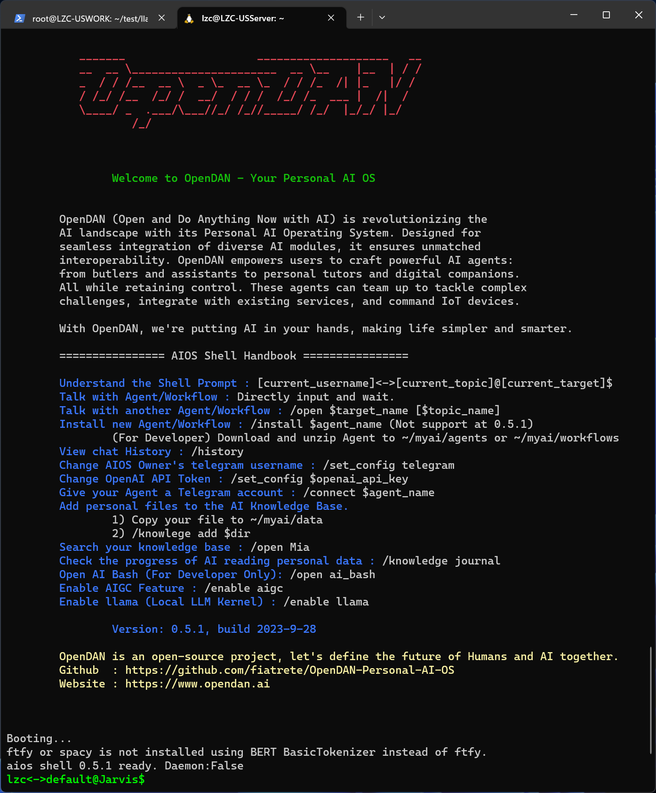

# OpenDAN Quick Start

OpenDAN (Open and Do Anything Now with AI) is revolutionizing the AI landscape with its Personal AI Operating System. Designed for seamless integration of diverse AI modules, it ensures unmatched interoperability. OpenDAN empowers users to craft powerful AI agents—from butlers and assistants to personal tutors and digital companions—all while retaining control. These agents can team up to tackle complex challenges, integrate with existing services, and command smart(IoT) devices. 

With OpenDAN, we're putting AI in your hands, making life simpler and smarter.

This project is still in its very early stages, and there may be significant changes in the future.

## Installation

There are two ways to install the Internal Test Version of OpenDAN:

1. Installation through docker, this is also the installation method we recommend now
2. Installing through the source code, this method may encounter some traditional Pyhont dependence problems and requires you to have a certain ability to solve.But if you want to do secondary development of OpenDAN, this method is necessary.

### Preparation before installation

1. Docker environment
This article does not introduce how to install the docker, execute it under your console

```
docker -version
```

If you can see the docker version number (> 20.0), it means that you have installed Docker.
If you don't know how to install docker, you can refer to [here](https://docs.docker.com/engine/install/)

2. OpenAI API Token
If there is no api token, you can apply for [here](https://beta.openai.com/)
(Applying for the API Token may have some thresholds for new players. You can find friends around you, and you can give you a temporary, or join our internal test experience group. We will also release some free experience API token from time to time.These token is limited to the maximum consumption and effective time)

### Install OpenDAN

After executing the following command, you can install the Docker Image of OpenDAN
```
docker pull paios/aios:latest
```

## Run

When you first run OpenDAN, you need to initialize it. During the initialization process, some basic models will be downloaded for the local Knowledge Base library, and you'll need to input some personal information. Therefore, remember to include the -it parameter when starting Docker.

OpenDAN is your Personal AIOS, so it will generate some important personal data (such as chat history with agent, schedule data, etc.) during its operation. These data will be stored on your local disk. ThereforeWe recommend that you mount the local disk into the container of Docker so that the data can be guaranteed.

```
docker run -v /your/local/myai/:/root/myai --name aios -it paios/aios:latest 
```

In the above command, we also set up a Docker instance for Docker Run named AIOS, which is convenient for subsequent operations.You can also use your favorite name instead

After executing the above command, if everything is normal, you will see the following interface


After the first operation of the docker instance is created, it only needs to be executed again:

```
docker start -ai aios
```

If you plan to run in a service mode (NO UI), you don't need to bring the -AI parameter:

```
docker start aios
```

## The first run configuration

If you have not used the character interface (CLI) in the past, you may not be used to it.But don't be nervous, even in the Internal Test version, you will only need to use CLI in a few cases.

OpenDAN must be a future operating system that everyone can easily use, so we hope that the use and configuration of OpenDAN are very friendly and simple.But in the Internal Test, we have not enough resources to achieve this goal.After thinking, we decided to support the use of OpenDAN by CLI.

OpenDAN uses LLM as the kernel of AIOS, and integrates many very COOL AI functions through different Agent/Workflow. You can experience some of the latest success of the AI industry in OpenDAN.To activate all the functions requires more configuration, but we only need to do two configurations for the first operation.

1. LLM Kernel

OpenDAN is a future AI Operating Yystem built around LLM, so the system must have `at least one LLM core`.

OpenDan configures LLM in the agent unit. Agent, which does not specify the LLM model name, will use GPT4 by default (GPT4 is also the smartest LLM).You can modify the local LLM that configures to LLaMa or other installed.Today, Local LLM requires the support of quite strong local computing resource, which requires a lot of one-time investment.

But we believe that the LLM field will also follow `Moore's law`. The future LLM model will become more and more powerful, smaller and cheaper.Therefore, we believe that in the future, everyone will have their own Local LLM.

2. Your personal information

This allows your personal AI assistant Jarvis to better serve you. Note that you must enter your own correct Telegram username, otherwise due to authority control, you will not be able to access Agent/Workflow installed on OpenDan through Telegram.

Okay, after a simple understanding of the above background, press the interface to prompt the input of the necessary information.

P.S:
The above configuration will be saved in the `/your/local/myai/etc/system.cfg.toml`, if you want to modify the configuration, you can directly modify this file.If you want to adjust the configuration, you can edit this file directly.


## (Experimental) Install the local LLM kernel 

For a quick first experience with OpenDAN, we strongly recommend using GPT4. Although it's slow and expensive, it's currently the most powerful and stable LLM core. OpenDAN's architectural design allows different agents to choose different LLM cores (there must be at least one available LLM core in the system). If for any reason you can't use GPT4, you can install Local LLM using the method below to get the system running. OpenDAN is a system designed for the future, and we believe that the capabilities of GPT4 today will definitely be the minimum for all LLMs in the future. But the current reality is that other LLMs, whether in terms of effects or functions, still have a noticeable gap with GPT4, so to fully experience OpenDAN, we still recommend using GPT4 for a certain period of time.

At present, we have only completed the adaptation of Local LLM based on Llama.cpp. Adapting new LLM cores for OpenDAN is not a complicated task, and engineers who need it can expand it on their own (remember to PR us~). If you have certain hands-on abilities, you can install the Compute Node based on Llama.cpp using the method below:

### Install LLama.cpp ComputeNode

OpenDAN supports distributed computing resource scheduling, so you can install the LLaMa computing node on a machine different from OpenDAN. Depending on the size of the model, substantial computing power is needed, so please proceed according to your machine's configuration. We use llama.cpp to build the LLaMa LLM ComputeNode. Llama.cpp is a rapidly evolving project that is committed to reducing the device threshold required to run LLM and improving running speed. Please read the llama.cpp project to understand the minimum system requirements for each supported model.

Installing LLaMa.cpp involves two steps:

Step1: Download the LLaMa.cpp model. There are three choices: 7B-Chat, 13B-Chat, 70B-Chat. Our practical experience shows that at least the 13B model is required to work. LLaMa2's official models currently do not support inner function calls, and many of OpenDAN's Agents heavily depend on inner function calls. So we recommend you download the Fine-Tuned 13B model:

```
https://huggingface.co/Trelis/Llama-2-13b-chat-hf-function-calling
```

Step2: Run the llama-cpp-python image

```
docker run --rm -it -p 8000:8000 -v /path/to/models:/models -e MODEL=/models/llama-2-13b-chat.gguf ghcr.io/abetlen/llama-cpp-python:latest
```

After completing the above steps, if the output is as follows, it means that LLaMa has correctly loaded the model and is running normally.

```
....................................................................................................
llama_new_context_with_model: kv self size  =  640.00 MB
llama_new_context_with_model: compute buffer total size =  305.47 MB
AVX = 1 | AVX2 = 1 | AVX512 = 0 | AVX512_VBMI = 0 | AVX512_VNNI = 0 | FMA = 1 | NEON = 0 | ARM_FMA = 0 | F16C = 1 | FP16_VA = 0 | WASM_SIMD = 0 | BLAS = 0 | SSE3 = 1 | SSSE3 = 1 | VSX = 0 | 
INFO:     Started server process [171]
INFO:     Waiting for application startup.
INFO:     Application startup complete.
INFO:     Uvicorn running on http://0.0.0.0:8000 (Press CTRL+C to quit)
```

### Add LLaMa.cpp ComputeNode to OpenDAN

ComputeNode is a basic component of OpenDAN and may not run on the same machine as OpenDAN. Therefore, from a dependency perspective, OpenDAN does not have the ability to "actively detect" ComputeNode. Users (or system administrators) need to manually add it in the command line of OpenDAN with the following command:

```
/node add llama Llama-2-13b-chat http://localhost:8000
```

The above command adds a 13b model running locally. If you are using a different model or running it on a different machine, please modify the model name and port number in the command.

### Configure Agent to Use LLaMa

OpenDAN's Agents can choose the LLM-Model that best suits their responsibilities. We have built-in an Agent called Lachlan, a private Spanish teacher Agent, which has been configured to use the LLaMa-2-13b-chat model. You can chat with it using the following command:

```
/open Lachlan
```

Therefore, after adding a new LLM-Kernel, you need to manually modify the Agent's configuration to allow it to use the new LLM. For example, our private English teacher Tracy, whose configuration file is `/opt/aios/agents/Tracy/Agent.toml`, modify the configuration as follows:

```
llm_model_name="Llama-2-13b-chat"
max_token_size = 4000
```

Then, after restarting OpenDAN, you can have Tracy use LLaMa (you can also use this method to see which LLM models other built-in Agents are using).

## Hello, Jarvis!

After the configuration is completed, you will enter a AIOS Shell, which is similar to Linux Bash and similar. The meaning of this interface is:
The current user "username" is communicating with the name "Agent/Workflow of Jarvis". The current topic is default.

Say Hello to your private AI assistant Jarvis !

If everything is OK, you will get a reply from Jarvis after a moment .At this time, the OpenDAN system is running

## Give a Telegram account to Jarvis

You've successfully installed and configured OpenDAN, and verified that it's working properly. Now, let's quickly return to the familiar graphical interface, back to the mobile internet world!
We'll be registering a Telegram account for Jarvis. Through Telegram, you can communicate with Jarvis in a way that feels familiar.
In the OpenDAN's aios_shell, type:

```
/connect Jarvis
```

Follow the prompts to input the Telegram Bot Token, and you'll have Jarvis set up. To learn how to obtain a Telegram Bot Token, you can refer to the following article:
https://core.telegram.org/bots#how-do-i-create-a-bot.

Additionally, we offer the option to register an email account for the Agent. Use the following command:

```
/connect Jarvis email
```

Then follow the prompts to link an email account to Jarvis. However, as the current system doesn't have a pre-filter customized for email contents, there's a potential for significant LLM access costs. Hence, email support is experimental. We recommend creating a brand-new email account for the Agent."

## Running OpenDAN as a Daemon

The method described above runs OpenDAN interactively, which is suitable for development and debugging purposes. For regular use, we recommend running OpenDAN as a service. This ensures OpenDAN operates silently in the background without disturbing your usual tasks.
First, input:

```
/exit
```

to shut down and exit OpenDAN. Then, we'll start OpenDAN as a service using:

```
docker start aios
```

Jarvis, which is an Agent running on OpenDAN, will also be terminated once OpenDAN exits. So, if you wish to communicate with Jarvis via Telegram anytime, anywhere, remember to keep OpenDAN running (don't turn off your computer and maintain an active internet connection).

In fact, OpenDAN is a quintessential Personal OS, operating atop a Personal Server. For a detailed definition of a Personal Server, you can refer to the [CYFS Owner Online Device(OOD)](https://github.com/buckyos/CYFS). Running on a PC or laptop isn't the formal choice, but then again, aren't we in an Internal Test phase?

Much of our ongoing research and development work aims to provide an easy setup for a Personal Server equipped with AIOS. Compared to a PC, we're coining this new device as PI (Personal Intelligence), with OpenDAN being the premier OS tailored for the PI.

## Introducing Jarvis: Your Personal Butler!

Now you can talk with Jarvis anytime, anywhere via Telegram. However, merely seeing him as a more accessible ChatGPT doesn't do justice to his capabilities. Let's dive in and see what new tricks Jarvis, running on OpenDAN, brings to the table!

## Let Jarvis Plan Your Schedule

Many folks rely on traditional calendar software like Outlook to manage their schedules. I personally spend at least two hours each week using such applications. Manual adjustments to plans, especially unforeseen ones, can be tedious. As your personal butler, Jarvis should effortlessly manage your schedule through natural language!
Try telling Jarvis:

```
I'm going hiking with Alice on Saturday morning and seeing a movie in the afternoon!
```

If everything's in order, you'll see Jarvis' response, and he'll remember your plans.
You can inquire about your plans with Jarvis using natural language, like:

```
What are my plans for this weekend?
```

Jarvis will respond with a list of your scheduled activities.
Since Jarvis uses LLM as its thinking core, he can communicate with you seamlessly, adjusting your schedule when needed. For instance, you can tell him:

```
A friend is coming over from LA on Saturday, and it's been ages since we last met. Shift all of Saturday's appointments to Sunday, please!
```

Jarvis will seamlessly reschedule your Saturday plans for Sunday.
Throughout these interactions, there's no need to consciously use "schedule management language." As your butler, Jarvis understands your personal data and engages at the right moments, helping manage your schedule.
This is a basic yet practical illustration. Through this example, it's clear that people might no longer need to familiarize themselves with foundational software of today.

Welcome to the new era!

All the schedules set by the Agent are stored in the ~/myai/calender.db file, formatted as sqlite DB. In future updates, we plan to authorize Jarvis to access your production environment calendars (like the commonly-used Google Calendar). Still, our hope for the future is that people store vital personal data on a physically-owned Personal Server.

## Introducing Jarvis to Your Friends

Sharing Jarvis's Telegram account with your friends can lead to some interesting interactions. For instance, if they can't get in touch with you directly, they can communicate with Jarvis, your advanced personal assistant, to handle transactional tasks like inquiring about your recent schedules or plans.

After trying, you'll realize that Jarvis doesn't operate as anticipated. From a data privacy standpoint, Jarvis, by default, interacts only with "trusted individuals". To achieve the above objectives, you need to let Jarvis understand your interpersonal relationships.

### Let Jarvis Manage Your Contacts

OpenDAN stores the information of all known individuals in the myai/contacts.toml file. Currently, it's simply divided into two groups:

1. Family Member, At present, this group stores your information (logged during the system's initial setup).
2. Contact，These are typically your friends.

Anyone not listed in the aforementioned categories is classified as a Guest by the system. By default, Jarvis doesn't engage with Guests. Hence, if you want Jarvis to interact with your friends, you must add them to the Contact list.

You can manually edit the myai/contacts.toml file, or you can let Jarvis handle the contact addition. Try telling Jarvis:

```
Please add my friend Alice to my contacts. Her Telegram username is xxxx, and her email is xxxx.
```

Jarvis will comprehend your intent and carry out the task of adding the contact.
Once the contact is added, your friend can interact with your personal butler, Jarvis.

## Update OpenDAN 

As OpenDAN is still in its early stages, we regularly release images of OpenDAN to fix some bugs. Therefore, you may need to update your OpenDAN image regularly. Updating the OpenDAN image is very simple, just execute the following commands:

```
docker stop aios
docker rm aios
docker pull paios/aios:latest
docker run -v /your/local/myai/:/root/myai --name aios -it paios/aios:latest 
```

## Allowing Agents to Further Access Your Information

You already know that Jarvis can help you manage some important information. But these are all "new information". Since the invention of the PC in the 1980s, everything has been rapidly digitizing. Everyone already has a massive amount of digital information, including photos and videos you take with your smartphone, emails and documents generated at work, and so on. In the past, we managed this information through a file system, in the AI era, we will manage these pieces of information through a Knowledge Base. Information stored in the Knowledge Base can be better accessed by AI, allowing your Agent to understand you better and provide better service.

The Knowledge Base is a very important basic concept in OpenDAN, and it is a key reason why we need Personal AIOS. Technologies related to the Knowledge Base are currently developing rapidly, so the implementation of OpenDAN's Knowledge Base is also evolving rapidly. At present, our implementation is more about letting everyone experience the new capabilities brought by the combination of the Knowledge Base and Agent, and its effect is far from our expectations. From the perspective of system design, another purpose of our opening this component as soon as possible is to find a more user-friendly and smoother method on the product to import existing personal information into the Knowledge Base.

The Knowledge Base function is already turned on by default. There are two ways to put your own data into the Knowledge Base:

1. Copy the data to be put into the Knowledge Base into the `~myai/data` folder. 
2. By entering `/Knowledge add dir`, the system will ask you to input a local directory to be imported into the Knowledge Base. Note that OpenDAN runs in a container by default, so $dir is a path relative to the container. If you want to add data from the local disk, you need to mount the local data to the container first.

OpenDAN will continuously analyze the files in the Knowledge Base folder in the background, and the analysis results are saved in the ~/myai/knowledge directory. After deleting this directory, the system will re-analyze the files that have been added to the Knowledge Base. Since OpenDAN's Knowledge Base is still in its early stages, it currently only supports analyzing and recognizing text files, pictures, short videos, etc. In the future, OpenDAN will support all mainstream file formats and try to import all existing information into Knowledge. You can query the running status of the Knowledge Base analysis task in aios_shel with the following command:

```
/Knowledge journal
```

### Meet Your Personal Information Assistant, Mia

Then we can access the Knowledge Base through the Agent "Mia",

```
/open Mia
```

Try to communicate with Mia! I think this will bring a completely different experience! The information Mia finds will be displayed in the following way:

```
{"id": "7otCtsrzbAH3Nq8KQGtWivMXV5p54qrv15xFZPtXWmxh", "type": "image"}
```

You can use the `/knowledge query 7otCtsrzbAH3Nq8KQGtWivMXV5p54qrv15xFZPtXWmxh` command to call the local file viewer to view the results.

We recommend integrating Mia into Telegram, so Mia will directly display the query results in the form of images, which is more convenient to use~

### Embeding Pipeline

The process by which the Knowledge Base reads and analyzes files to generate information that the Agent can access is called Embedding. This process requires certain computational resources. According to our tests, the Embedding Pipeline built by OpenDAN based on "Sentence Transformers" can run on the vast majority of types of machines. The difference between machines of different capabilities mainly lies in the speed and quality of Embedding. Friends who understand the progress of OpenDAN may know that we have also supported cloud Embedding during the implementation process to completely reduce the minimum system performance requirements of OpenDAN. However, considering the large amount of personal privacy data involved in the Embedding process, we decided to turn off the cloud Embedding feature. Those in need can modify the source code to open cloud Embedding, allowing OpenDAN to work on very low-performance devices.

Unfortunately, there is no unified Embedding standard now, so the results generated by different Embedding Pipelines are not compatible with each other. This means that once the Embedding Pipeline is switched, all the information in the Knowledge Base needs to be rescanned.

## bash@ai

If you have a certain engineering background, by letting the Agent execute bash commands, you can also quickly and easily give OpenDAN access to your private data.

Use the command

```
/open ai_bash
```

to activate ai_bash. From there, you can execute traditional bash commands within the aios_shell command line. Plus, you'll have the ability to use smart commands. For example, to search for files, instead of using the 'find' command, you can simply say:

```
Help me find all files in ~/Documents that contain OpenDAN.
```

Pretty cool, right?

By default, OpenDAN operates inside a container, meaning ai_bash can only access files within that docker container. While this provides a relative level of security, we still advise caution. Do not expose the ai_bash agent recklessly, as it could pose potential security risks."

## Why Do We Need Personal AIOS?

Many people will first think of privacy, which is an important reason, but we don't think this is the real reason why people leave ChatGPT and choose Personal AIOS. After all, many people are not sensitive to privacy today. Moreover, today's platform manufacturers generally use your privacy to make money silently, and rarely really leak your privacy.

We believe the real value of Personal AIOS lies in:

1. Cost is an important determinant. LLM is a very powerful, clearly bounded core component, the CPU of the new era. From a product and business perspective, ChatGPT-like products only allow it to be used in limited ways. It reminds me of the era when minicomputers first appeared and everyone used the system in a time-sharing manner: useful, but limited. To truly realize the value of LLM, we need to allow everyone to have their own LLM and freely use LLM as the underlying component of any application. This requires a new operating system built around LLM to re-abstract applications (Agent/Workflow) and the resources used by applications (computing power, data, environment).

2. When you have LLM, when you can put LLM in front of every compute, you will see the real treasure! The current ChatGPT's extension of LLM capabilities through plugins is very limited in both capabilities and boundaries. This is due to both commercial cost reasons and the legal boundary issues of traditional cloud services: the platform bears too much responsibility. But by using LLM in Personal AIOS, you can freely connect natural language, LLM, existing services, private data, and smart devices without worrying about privacy leaks and liability issues (you bear the consequences of authorizing LLM yourself)!
OpenDAN is an open-source project, let's define the future of Humans and AI together!