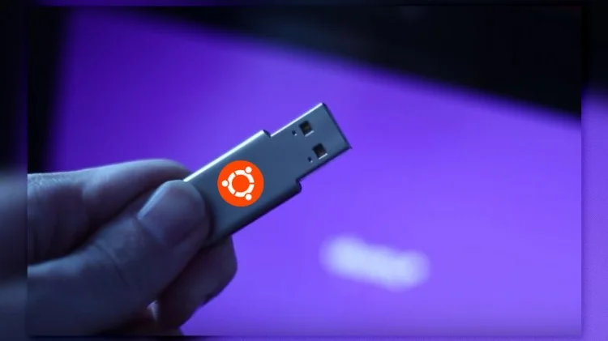

# How to create a opendan Ubuntu live from scratch

<p align="center">
   
</p>

This procedure shows how to create a **bootable** and **installable** opendan Ubuntu Live (along with the automatic hardware detection and configuration) from scratch.  The steps described below are also available in this repo in the `/scripts` directory.

## Prerequisites (GNU/Linux Debian/Ubuntu)

- Docker is needed on your system

## Create opendan Ubuntu builder environment

First we run **docker_create_env.sh** to create a container for building the live image.

   ```shell
  sudo sh docker_create_env.sh
   ```

## Build opendan Ubuntu live image

Then we run **docker_run_build.sh** to generate live image iso. The image built will be copied to `images` directory

   ```shell
  sudo sh docker_run_build.sh
   ```
 
## Make a bootable USB image

It is simple and easy, using "dd"

```shell
sudo dd if=ubuntu-opendan.iso of=<device> status=progress oflag=sync
```

## Summary

This completes the process of creating a live opendan Ubuntu installer from scratch.  The generated ISO may be tested in a virtual machine such as `VirtualBox` or written to media and booted from a standard PC.

## Contributing

Please read [CONTRIBUTING.md](CONTRIBUTING.md) for details on our code of conduct, and the process for submitting pull requests to us.

## License

This project is licensed under the GNU GENERAL PUBLIC LICENSE - see the [LICENSE](LICENSE) file for details

## Origin

This packaging scripts origins from [live-custom-ubuntu-from-scratch](https://github.com/mvallim/live-custom-ubuntu-from-scratch)
